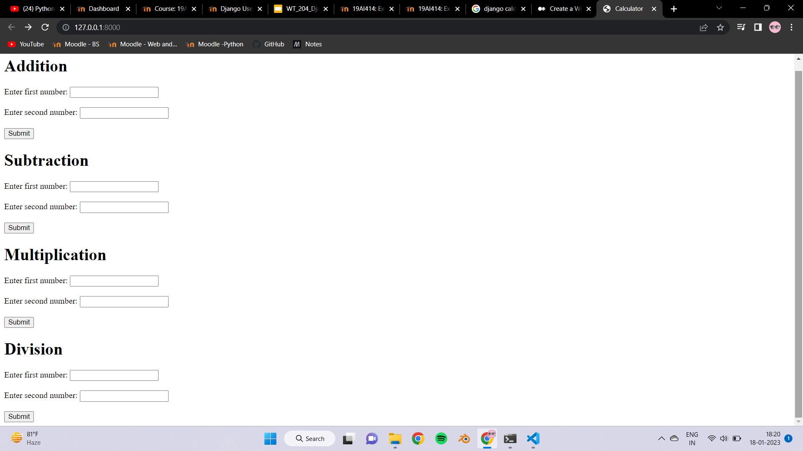
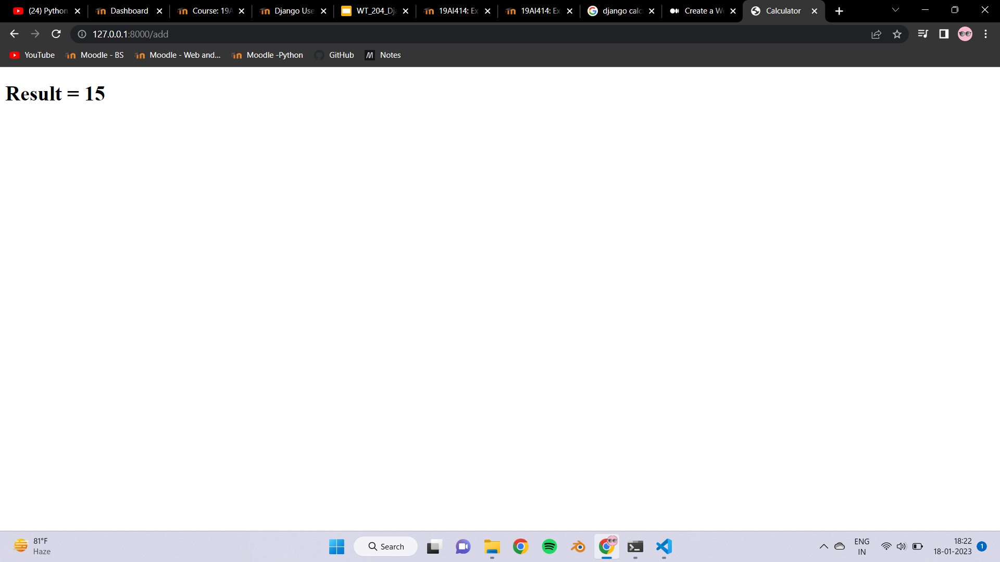
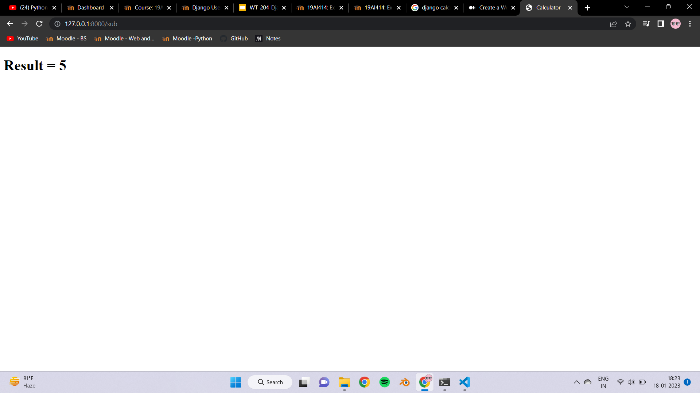

# Design a Website for Server Side Processing

# AIM:

To design a website to perform mathematical calculations in server side.

# DESIGN STEPS:

## Step 1:
Create a Django Project and Django Application using Django Commands.

## Step 2:
Create a urls.py file in application and add the required URL patterns.

## Step 3:
Create the views file in the application

## Step 4:
Create a templates folder and create the HTML files that is required to run the program

## Step 5:
Run the server and display it on the Browser.
# PROGRAM:
```
BASIC HTML
<!DOCTYPE html>
<html lang="en">
<head>
    <meta charset="UTF-8">
    <meta name="viewport" content="width=device-width, initial-scale=1.0">
    <title>Calculator</title>
</head>
<body>
    

    
</body>
</html>
```
```
INPUT HTML




<h1>Addition</h1>
<form action="add" method="POST">
    

    Enter first number: <input type="text" name="num1"><br><br>
    Enter second number: <input type="text" name="num2"><br><br>
    <input type="submit">
</form>

<h1>Subtraction</h1>
<form action="sub" method="POST">
    

    Enter first number: <input type="text" name="num1"><br><br>
    Enter second number: <input type="text" name="num2"><br><br>
    <input type="submit">
</form>

<h1>Multiplication</h1>
<form action="multi" method="POST">
    

    Enter first number: <input type="text" name="num1"><br><br>
    Enter second number: <input type="text" name="num2"><br><br>
    <input type="submit">
</form>

<h1>Division</h1>
<form action="div" method="POST">
    

    Enter first number: <input type="text" name="num1"><br><br>
    Enter second number: <input type="text" name="num2"><br><br>
    <input type="submit">
</form>


```
```
RESULT HTML




<h1> Result = {{result}} </h1>


```
# OUTPUT:





# RESULT:

The program is executed succesfully
